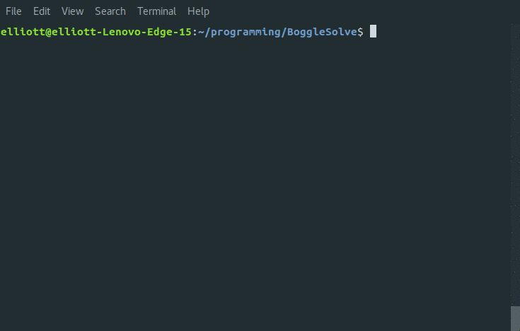

## Introduction

This program solves a word game called Boggle. It was my final project for my second ever programming class (Data Structures), although I recently made some improvements.

Boggle is played with a 4x4 grid of tiles, where each tile is printed with a letter. The tiles are shuffled/randomized at the beginning of each round. A player searches for words that can be constructed from the letters of sequentially adjacent tiles, where "adjacent" tiles are those horizontally, vertically, and diagonally neighboring. Words must be at least three letters long, and may not use the same tile more than once per word.

## Implementation

For each tile on the board, a tree is constructed with that tile as its root. The trees are constructed recursively, in the following manner:

A tile *t<sub>1</sub>* adjacent to tile *t<sub>0</sub>* is added as a child node to *t<sub>0</sub>* if:

+ *t<sub>1</sub>* is not already present in the tree as an ancestor of *t<sub>0</sub>*, and
+ *s* is the beginning of a word (a prefix), or is a word, where *s* is the string formed by prepending *t<sub>1</sub>*, *t<sub>0</sub>*, and all ancestors of *t<sub>0</sub>*, sequentially.

If *s* is a word, it is added to the solution set.

To check if *s* is a prefix or a word, a dictionary is needed. The dictionary is implemented as a [trie](https://en.wikipedia.org/wiki/Tree_(data_structure) "Wikipedia"), which is optimal for checking if a string is a prefix. In this case, each node of the trie holds a flag indicating if its key is a full english word.


## Usage

```bash
make
./BoggleSolve
```

## Notes / To Do

+ Typically, Boggle has no 'Q' tiles; instead there are 'Qu' tiles. In this program, all tiles have one letter and 'Q's are treated as any other letter.
+ Typically, Boggle does not have an equal distribution of tiles across letters -- there are more 'A's than 'X's, for example. In this program, when option (1) "New random board" is selected, letters are generated with equal probability.
+ Checks on user input should be added for option (2) "New custom board". As of now, only lowercase letters will give correct behavior, but other charectors are not rejected.


## Demo

